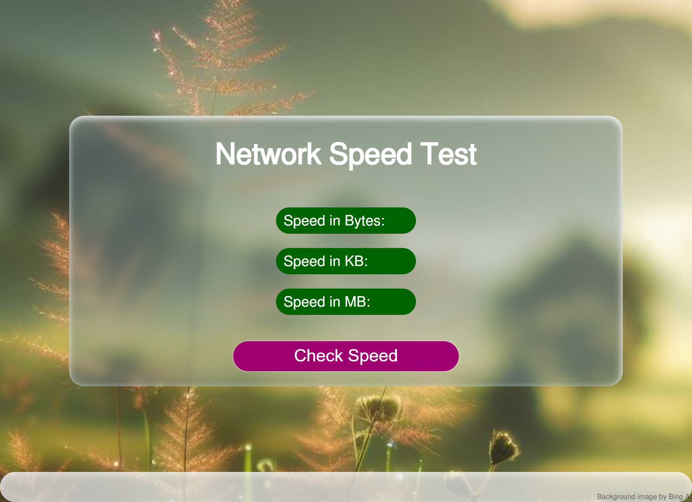

#  Internet Speed Test

**Easily measure your internet's download speed!**

This project provides a simple way to test your internet's download speed. With just a click, you can get a quick assessment of your connection's performance.

**Open the Test Page:**
    Navigate to the `Network speed test.html` file within the cloned repository and open it in your web browser.

**How it Works**

In essence, the page downloads an image, determines its size and duration, and then displays the download speed. Most browsers cache images after they are downloaded, which causes the test to display the incorrect speed the next time it is run. I therefore added a variable to use distinct queries in order to prevent the browser from saving the image.

**Image:**

**Next Steps**

- Feel free to customize the appearance and functionality of the test page to suit your preferences.
- Explore internet speed testing libraries and techniques to enhance the accuracy and capabilities of the test.

**Additional Notes**

- This is a very basic example of measuring the internet download speed using image loading speed.
- You can customise this project as you want.

We hope this project helps you keep tabs on your internet's performance!
